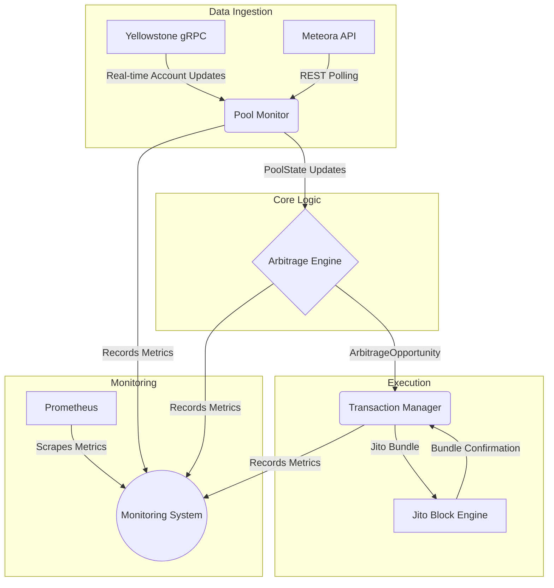

'''# System Architecture

This document provides a detailed overview of the Solana arbitrage trading bot's architecture, components, and data flow.

## 1. Architectural Principles

The system is designed based on the following principles:

*   **Performance**: The bot is written in Rust to achieve the low-latency execution required for competitive arbitrage trading on the Solana network.
*   **Modularity**: The architecture is divided into independent, loosely coupled components, facilitating development, testing, and maintenance.
*   **Reliability**: The bot includes robust error handling, retry mechanisms, and a circuit breaker to ensure stable operation in a volatile environment.
*   **Scalability**: The design allows for future expansion, such as monitoring additional liquidity pools or implementing more complex arbitrage strategies.

## 2. High-Level Architecture

The bot follows a multi-threaded, event-driven architecture, composed of three primary services that communicate through asynchronous channels:

1.  **Pool Monitor**: Responsible for ingesting real-time data from the Solana blockchain and external APIs.
2.  **Arbitrage Engine**: The core logic unit that processes pool data and identifies trading opportunities.
3.  **Transaction Manager**: Handles the construction, submission, and monitoring of atomic transactions.

### 2.1. Component Diagram

## 3. Component-Level Design

### 3.1. Pool Monitor

This component is the bot's primary interface to the Solana network. It is responsible for maintaining a near real-time view of the target liquidity pools.

*   **Technology**: Rust, `tokio`, `tonic` (for gRPC), `reqwest` (for REST).
*   **Primary Functions**:
    *   Establishes a persistent gRPC stream to a Yellowstone-enabled RPC endpoint to subscribe to account updates for the A/SOL and B/SOL pools.
    *   Periodically polls the Meteora REST API to fetch the state of the A/B pool.
    *   Parses incoming data to create standardized `PoolState` objects.
    *   Sends `PoolUpdateEvent`s to the Arbitrage Engine via an asynchronous channel.
*   **Resilience**: Implements exponential backoff and retry logic for both gRPC and REST connections.

### 3.2. Arbitrage Engine

The Arbitrage Engine is the decision-making core of the bot. It processes the data from the Pool Monitor to identify and validate profitable trades.

*   **Technology**: Rust, `rust_decimal` for high-precision arithmetic.
*   **Primary Functions**:
    *   Receives `PoolUpdateEvent`s and updates its internal state of the three liquidity pools.
    *   Upon each state update, it calculates the potential outcomes of the two possible triangular arbitrage paths (SOL → A → B → SOL and SOL → B → A → SOL).
    *   The calculation uses a constant product formula and accounts for swap fees for each pool.
    *   It determines the net profit by subtracting estimated transaction fees (including priority fees and Jito tips) from the gross profit.
    *   If the net profit exceeds a configurable threshold, it constructs an `ArbitrageOpportunity` object and sends it to the Transaction Manager.

### 3.3. Transaction Manager

This component is responsible for the secure and reliable execution of trades.

*   **Technology**: Rust, `solana-sdk`, `solana-client`, `bincode`.
*   **Primary Functions**:
    *   Receives `ArbitrageOpportunity` objects from the Arbitrage Engine.
    *   Constructs the three separate swap transactions required for the arbitrage.
    *   Adds a priority fee instruction to the first transaction to incentivize faster inclusion.
    *   Creates a final tip transaction to a Jito tip account.
    *   Serializes and bundles all four transactions into a Jito bundle.
    *   Submits the bundle to the Jito Block Engine API.
    *   Polls the Jito API to monitor the bundle's status until it is either confirmed (`landed`) or fails.
    *   Reports the final status of the trade to the Monitoring System.

## 4. Data Flow and Communication

Communication between the main components is handled by `tokio::sync::mpsc` channels, which allow for non-blocking, asynchronous message passing.

1.  The `PoolMonitor` runs in a dedicated thread, continuously pushing `PoolUpdateEvent`s into a channel.
2.  The `ArbitrageEngine` runs in its own thread, consuming events from the pool update channel. When a trade is found, it pushes an `ArbitrageOpportunity` into a trade channel.
3.  The `TransactionManager` runs in a third thread, consuming from the trade channel and executing the trades.

This decoupled design ensures that data ingestion is not blocked by trade execution, and the core arbitrage logic can operate independently of network latency.

## 5. Safety and Monitoring

The `MonitoringSystem` is an overarching component that integrates with all other parts of the bot.

*   **Circuit Breaker**: Halts all trading activity if a configurable number of consecutive trades fail or if total losses exceed a certain threshold.
*   **Logging**: Structured logging is implemented throughout the application to provide detailed insights into the bot's behavior.
*   **Metrics**: Exposes a `/metrics` endpoint for Prometheus to scrape, providing real-time data on trades, profitability, and system health.
'''
